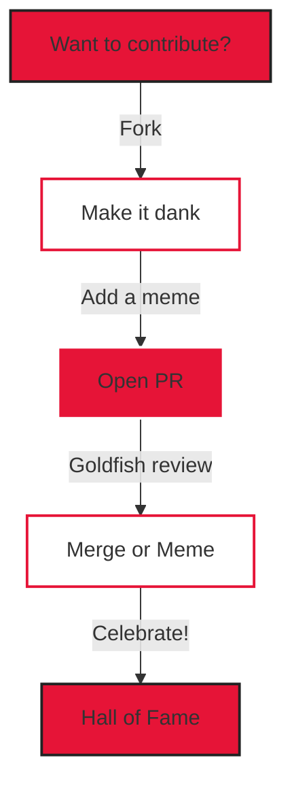

> **hello world**
>
> You just tripped and fell into the most chaotic, meme-fueled, coffee-powered repo on GitHub. No code, just vibes, memes, and the color **rgb(230, 20, 55)**. If you're not running on caffeine and existential dread, are you even a dev?


---

## 🏅 Badges


---

## 🧭 Table of Contents
- [About Me](#about-me)
- [Fun Facts](#fun-facts)
- [How to Use This Repo](#how-to-use-this-repo)
- [Contributing](#contributing)
- [License](#license)
- [FAQ](#faq)
- [Roadmap](#roadmap)
- [Known Issues](#known-issues)
- [Hall of Fame](#hall-of-fame)
- [Contact](#contact)

---

## 🤔 About Me
Hey! I'm **Numan** — your local sleep-deprived, meme-obsessed, coffee-guzzling dev. I:
- Can spot a bug faster than my WiFi drops
- Have a playlist for every mood (lofi, synthwave, and "existential crisis at 3am")
- Will always pick the red Skittle (fight me)
- Am probably thinking about pizza, coffee, or both
- Believe in the power of Ctrl+Z and a good nap
- Debug my life with rubber ducks and existential memes
- Love all things quirky, diverse, and inclusive (everyone's welcome here!)

If you're reading this, you're officially part of the squad. 🦄

---

## 🎉 Fun Facts
- My favorite color is **rgb(230, 20, 55)** (it's a whole mood)
- I once convinced a rubber duck to debug my code (it judged me)
- I can recite the alphabet backwards (after 3 cups of coffee)
- I love fun videos with pandas ([click here](https://www.youtube.com/watch?v=dQw4w9WgXcQ))
- I have a black belt in Googling (Stack Overflow is my dojo)
- I can touch my toes (on a good day, after stretching, maybe)
- I once ate an entire pizza by myself (no regrets, only carbs)
- I've never been rickrolled... or have I? (see above)
- I code in dark mode only (light mode is for the bold)
- My spirit animal is a caffeinated squirrel
- I believe diversity = strength (bring your weird, bring your awesome)

---

## 🛠️ How to Use This Repo
1. Clone it (for the memes)
2. Bask in the glory of the README
3. Show it to your coolest friend (or your cat)
4. Add a fun fact to your own README
5. Try to find the hidden panda (hint: it's above)
6. Drink coffee, contemplate existence
7. Repeat as needed for maximum YN energy

---

## 🤝 Contributing
Want to join the chaos? Here's the flow:



- PRs must include at least one meme, joke, or fun fact
- Serious code will be rejected (there is no code, only chaos)
- Gold stars for creative emoji use 🌟
- All PRs reviewed by my pet goldfish 🐟 (and sometimes my cat)
- Bonus points for diversity, inclusivity, and dankness

---

## 📜 License
This repo is under the **Numan Public License (NPL)**. You can fork, star, remix, or just vibe. No warranties, only good times.

### 🪄 Numan's Blessing
> "May your memes be spicy, your coffee strong, and your bugs tiny."

---

## ❓ FAQ
**Q: What does this repo do?**
A: It radiates good vibes, memes, and confuses recruiters.

**Q: Can I use this in production?**
A: Only if your production is a meme factory or a coffee shop.

**Q: Is Numan real?**
A: No, Sadly Not, Numan Is Not Real, You are
Hallucinating Right Now. WAKE UP

**Q: Is there a secret here?**
A: Maybe. Maybe not. (But you already found the panda's right?)

**Q: Is this repo diverse?**
A: Like a bag of Skittles, but with more caffeine.

---

## 🗺️ Roadmap
- [x] Make a README that slaps
- [ ] Get a shoutout from a rubber duck
- [ ] Take over the world (pending)
- [ ] Win a Nobel Prize for README excellence
- [ ] Get sponsored by a coffee brand
- [ ] Add more memes, more diversity, more chaos
- [ ] Get a PR from a time traveler
- [ ] README that makes coffee (AI, do your thing)
- [ ] Convince a recruiter this is a real project

---

## 🐞 Known Issues
- Does not make coffee ☕ (yet)
- README may cause spontaneous dance parties
- May be too awesome for some users
- Not responsible for sudden urge to vibe
- May induce existential dread at 3am
- Cat hair in the repo (sorry)

---

## 🏆 Hall of Fame
- Numan – The Legend
- Goldfish – Chief Reviewer
- Rubber Duck – Debugging Guru
- Cat – Sleep Disruptor
- You – For being awesome and reading this far
- Everyone who brings their own flavor to the squad
- Numan at 2am – Existential Philosopher
- 404 – Motivation Not Found

---

## 📬 Contact
- [Email](mailto:dev.numan@proton.me)
- **Secret Code:** Whisper "agent goldfish" into the void and I'll probably hear you

> _Thanks for stopping by!_ 🚀
> 
> _Now go touch some grass, drink some water, and write some dank code!_ 

## 🐟 Chief Morale Officer: Goldfish
```
    /\
    _/./
 ,-'    `-:..-'/
: o )      _  (
"`-....,--; `-.\
    `'  "
```
> “All PRs must be approved by the goldfish. If the goldfish is asleep, approval may be delayed.” 
